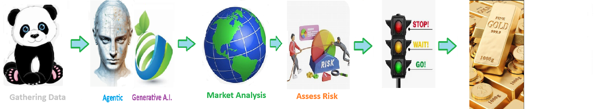

    
# Midastouch 

## Learning how to trade GOLD futures 

    
## 🧠 Midas Touch

**Learning** to trade Gold Futures

#### King Midas

King Midas was a legendary king granted a wish that everything he touched would turn to gold.
At first delighted, he soon realized the gift was a curse when food, drink, and even his daughter turned to gold.
The myth serves as a warning about greed and the unintended consequences of valuing wealth over human life.

##  💹 🟡 Five Critical Steps to Day Trading Gold Futures (Directional, Risk-Gated)

## 1️⃣ Gather High-Quality, Timely Market Data  
Collect real-time or near-real-time data for gold futures (price, volume, volatility), spot gold, U.S. Dollar Index (DXY), Treasury yields, and the economic calendar (CPI, Fed events).  
**Goal:** Identify today’s drivers and volatility windows.

---

## 2️⃣ Analyze Market Direction and Trade Thesis  
Establish an intraday bias (bullish, bearish, or neutral) using trend (VWAP, moving averages), momentum (RSI, MACD), volatility, and key price levels (overnight range, prior close).  
**Output:** A clear *trade thesis* with invalidation levels.

---

## 3️⃣ Risk & Confidence Gate (GO / NO-GO DECISION)  
Evaluate whether the trade meets minimum risk-quality standards before entry:
- Risk-to-reward threshold (e.g., ≥ 2:1)
- Volatility vs stop distance
- Time-of-day liquidity
- News proximity risk
- Signal confidence score (historical win rate, setup quality)

**Decision:**  
- ✅ **GO** → proceed to execution  
- ❌ **NO-GO** → stand down

**Goal:** Only trade *high-quality risk opportunities*.

---

## 4️⃣ Position Sizing & Execution (Kelly-Informed)  
Determine position size using **fractional Kelly**, based on:
- Estimated win probability
- Average win vs loss
- Account risk limits

Then execute via market or limit orders at pre-defined levels (breakout, pullback, VWAP reclaim).

**Goal:** Size intelligently while respecting execution discipline.

---

## 5️⃣ Exit Safely and Lock in Profit  
Scale out, trail stops, or exit at predefined targets or momentum exhaustion—never let winners reverse into losses.  
Flatten exposure by session end.

**Goal:** Capital preservation, consistency, and controlled profitability.

---

### 🔑 Key Insight
- **Kelly does NOT decide whether to trade**
- **Kelly decides how much to trade**
- The **GO / NO-GO gate decides if the trade deserves capital at all**

> *No trade is a position.*

---

### 🔑 Core Principle  
**Direction first. Risk second. Execution third. Profit follows.**

## 🟡 Top Data Points for Evaluating Gold Futures

1. **Spot Gold Price** — The **current cash market price** of gold, which anchors futures contracts and reflects immediate supply and demand.
2. **Futures Curve (Contango/Backwardation)** — Shows how **future delivery prices** compare to spot, indicating storage costs, interest rates, and market expectations.
3. **U.S. Dollar Index (DXY)** — Gold is priced in dollars, so a **stronger dollar** usually puts downward pressure on gold prices.
4. **Real Interest Rates** — **Rising real yields** make non-yielding assets like gold less attractive, while falling real rates support higher gold prices.
5. **Inflation Expectations** — Gold often rises when investors **expect inflation to erode** the purchasing power of fiat currencies.
6. **Central Bank Gold Purchases** — **Large-scale buying or selling by central banks** significantly affects global demand and long-term price trends.
7. **COMEX Open Interest** — Measures **how many gold futures contracts are active**, signaling speculative and hedging interest in the market.
8. **ETF Gold Holdings (e.g., GLD)** — Inflows and outflows from gold **ETFs** reflect institutional and retail **investor sentiment toward gold**.
9. **Geopolitical Risk Index** — Wars, sanctions, and **global instability** increase safe-haven demand for gold.
10. **Mining Supply and Production Costs** — Changes in **gold output and extraction costs** affect long-term supply and price floors.

## What are gold ETF's 

**Gold ETFs (Exchange-Traded Funds)** are investment funds that let you buy and sell exposure to the price of gold on the stock market without having to physically own or store gold.

They work by either holding physical **gold in vaults (like GLD or IAU)** or by holding gold futures contracts, and each share represents a fractional claim on that gold or its price movement.
Gold ETFs make it easy for investors to **trade gold like a stock**, use it for **inflation protection**, portfolio diversification, or as a **safe-haven** asset during economic uncertainty.

# 💰 Spot Gold Price 🪙

The **spot gold price** is the **current market price** for immediate delivery of gold, reflecting real-time supply and demand in global bullion markets. It is reported continuously by major commodity exchanges and data providers such as the London Bullion Market Association (LBMA), COMEX, and financial platforms like Bloomberg, Reuters, and major market websites.

import yfinance as yf

gold = yf.Ticker("XAUUSD=X")
price = gold.history(period="1d")["Close"].iloc[-1]

print(f"Spot Gold Price (USD/oz): {price}")

Welcome to the solution **Midastouch** 

Learning how to trade GOLD futures 

 
## 🧠 Midas Touch

**Learning** to trade Gold Futures

#### King Midas

King Midas was a legendary king granted a wish that everything he touched would turn to gold.
At first delighted, he soon realized the gift was a curse when food, drink, and even his daughter turned to gold.
The myth serves as a warning about greed and the unintended consequences of valuing wealth over human life.

##  💹 🟡 Five Critical Steps to Day Trading Gold Futures (Directional, Risk-Gated)

## 1️⃣ Gather High-Quality, Timely Market Data  
Collect real-time or near-real-time data for gold futures (price, volume, volatility), spot gold, U.S. Dollar Index (DXY), Treasury yields, and the economic calendar (CPI, Fed events).  
**Goal:** Identify today’s drivers and volatility windows.

---

## 2️⃣ Analyze Market Direction and Trade Thesis  
Establish an intraday bias (bullish, bearish, or neutral) using trend (VWAP, moving averages), momentum (RSI, MACD), volatility, and key price levels (overnight range, prior close).  
**Output:** A clear *trade thesis* with invalidation levels.

---

## 3️⃣ Risk & Confidence Gate (GO / NO-GO DECISION)  
Evaluate whether the trade meets minimum risk-quality standards before entry:
- Risk-to-reward threshold (e.g., ≥ 2:1)
- Volatility vs stop distance
- Time-of-day liquidity
- News proximity risk
- Signal confidence score (historical win rate, setup quality)

**Decision:**  
- ✅ **GO** → proceed to execution  
- ❌ **NO-GO** → stand down

**Goal:** Only trade *high-quality risk opportunities*.

---

## 4️⃣ Position Sizing & Execution (Kelly-Informed)  
Determine position size using **fractional Kelly**, based on:
- Estimated win probability
- Average win vs loss
- Account risk limits

Then execute via market or limit orders at pre-defined levels (breakout, pullback, VWAP reclaim).

**Goal:** Size intelligently while respecting execution discipline.

---

## 5️⃣ Exit Safely and Lock in Profit  
Scale out, trail stops, or exit at predefined targets or momentum exhaustion—never let winners reverse into losses.  
Flatten exposure by session end.

**Goal:** Capital preservation, consistency, and controlled profitability.

---

### 🔑 Key Insight
- **Kelly does NOT decide whether to trade**
- **Kelly decides how much to trade**
- The **GO / NO-GO gate decides if the trade deserves capital at all**

> *No trade is a position.*

---

### 🔑 Core Principle  
**Direction first. Risk second. Execution third. Profit follows.**

## 🟡 Top Data Points for Evaluating Gold Futures

1. **Spot Gold Price** — The **current cash market price** of gold, which anchors futures contracts and reflects immediate supply and demand.
2. **Futures Curve (Contango/Backwardation)** — Shows how **future delivery prices** compare to spot, indicating storage costs, interest rates, and market expectations.
3. **U.S. Dollar Index (DXY)** — Gold is priced in dollars, so a **stronger dollar** usually puts downward pressure on gold prices.
4. **Real Interest Rates** — **Rising real yields** make non-yielding assets like gold less attractive, while falling real rates support higher gold prices.
5. **Inflation Expectations** — Gold often rises when investors **expect inflation to erode** the purchasing power of fiat currencies.
6. **Central Bank Gold Purchases** — **Large-scale buying or selling by central banks** significantly affects global demand and long-term price trends.
7. **COMEX Open Interest** — Measures **how many gold futures contracts are active**, signaling speculative and hedging interest in the market.
8. **ETF Gold Holdings (e.g., GLD)** — Inflows and outflows from gold **ETFs** reflect institutional and retail **investor sentiment toward gold**.
9. **Geopolitical Risk Index** — Wars, sanctions, and **global instability** increase safe-haven demand for gold.
10. **Mining Supply and Production Costs** — Changes in **gold output and extraction costs** affect long-term supply and price floors.

## What are gold ETF's 

**Gold ETFs (Exchange-Traded Funds)** are investment funds that let you buy and sell exposure to the price of gold on the stock market without having to physically own or store gold.

They work by either holding physical **gold in vaults (like GLD or IAU)** or by holding gold futures contracts, and each share represents a fractional claim on that gold or its price movement.
Gold ETFs make it easy for investors to **trade gold like a stock**, use it for **inflation protection**, portfolio diversification, or as a **safe-haven** asset during economic uncertainty.

# 💰 Spot Gold Price 🪙

The **spot gold price** is the **current market price** for immediate delivery of gold, reflecting real-time supply and demand in global bullion markets. It is reported continuously by major commodity exchanges and data providers such as the London Bullion Market Association (LBMA), COMEX, and financial platforms like Bloomberg, Reuters, and major market websites.

import yfinance as yf

gold = yf.Ticker("XAUUSD=X")
price = gold.history(period="1d")["Close"].iloc[-1]

print(f"Spot Gold Price (USD/oz): {price}")

 

## Getting Started

The goal of this solution is to **Jump Start** your development and have you up and running in 30 minutes. 

To get started with the **Midastouch** solution repository, follow these steps:
1. Clone the repository to your local machine.
2. Install the required dependencies listed at the top of the notebook.
3. Explore the example code provided in the repository and experiment.
4. Run the notebook and make it your own - **EASY !**
    
## 🧠 Solution Features

- ✅ Easy to understand and use  
- ✅ Easily Configurable 
- ✅ Quickly start your project with pre-built templates
- ✅ Its Fast and Automated
- ✅ Saves You Time 

## ⚙️ Key Features

- ✅ **Self Documenting** Automatically identifies and annotates major steps in a notebook, making the codebase readable and well structured.
- ✅ **Self Testing** Includes built in **unit tests** for each function to validate logic and ensure code reliability.
- ✅ **Easily Configurable** Uses a simple **config.ini** file for centralized settings and easy customization through key value pairs.
- ✅ **Talking Code** explains itself through inline commentary, helping you understand both **what** it does and **why** it does it.
- ✅ **Self Logging** extends Python’s standard **logging** module for **step by step runtime insights**.
- ✅ **Self Debugging** Includes debugging hooks and detailed error tracing to simplify development and troubleshooting.
- ✅ **Low Code or  No Code** Designed to minimize complexity — most full solutions are under 50 lines of code.
- ✅ **Educational** Each template includes educational narrative and background context to support learning, teaching, and collaborative development.

    